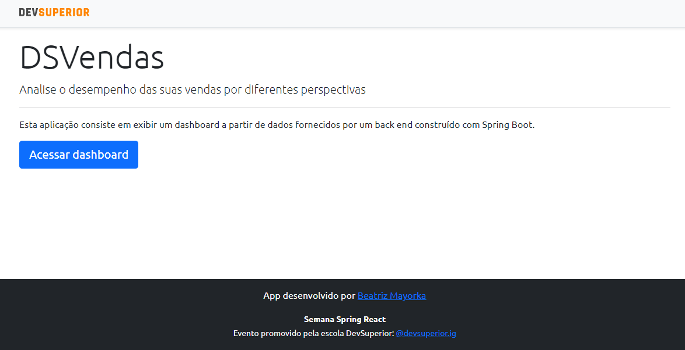
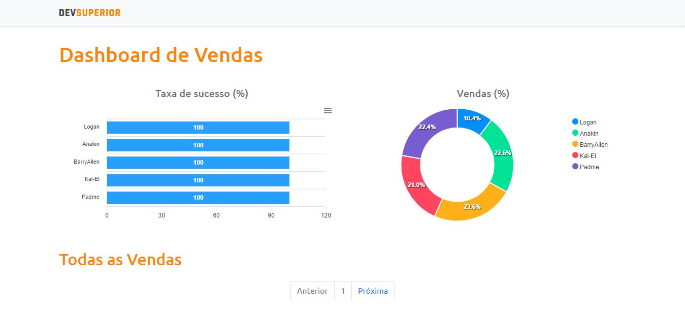
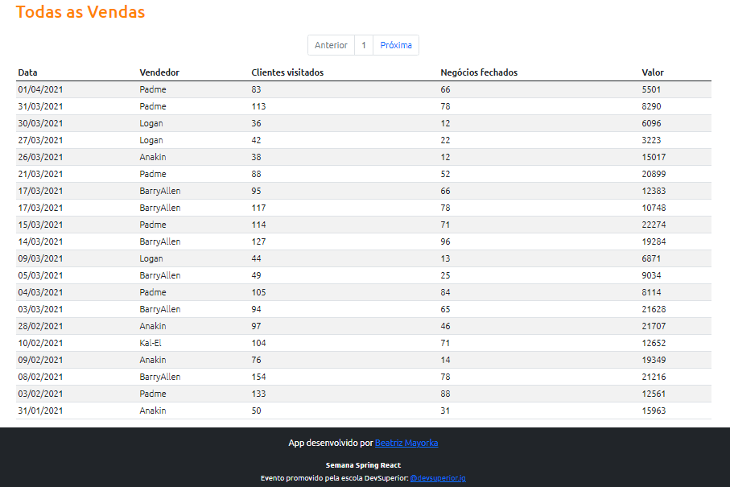

# Aplicativo Web DSVendas

    Esta aplicação utiliza Java com Spring Boot no back end e TypeScript com ReactJS no Front end

### Página Inicial 

### Segunda Página 

    Consiste num Dashboard de vendas com gráficos correspondentes à poncentagem de venda realizada 
    por cada vendendor e a taxa de sucesso

    Aqui é possível analisar o relatório de vendas

# Ferramenta necessária para executar esse projeto:  

-   Spring Tool Suite 

    Encontre a primeira opção de download -> Spring Tools 4 for Eclipse

    -> spring.io/tools
